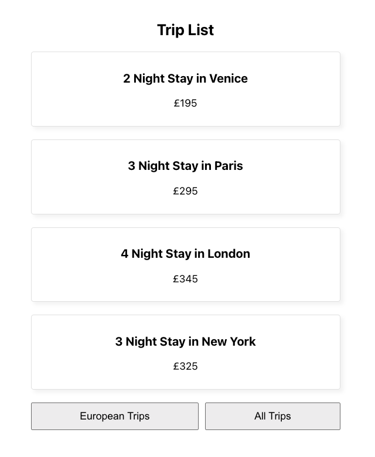

# React_Tripago

Repository created following this [Udemy Course](https://www.udemy.com/course/build-web-apps-with-react-firebase/) to practice the following basic React concepts:

- useEffect Hook & its dependency array
- usecallback Hook & its dependency array
- Custom hooks

## Application

Application fetch a list of trips by using axios within a custom hook. You can switch between trips location by clicking the bottom buttons. Pending state & errors are also being handled within the hook.



## Run Locally

Clone the project

```bash
  git clone https://github.com/pedrolopezbiedma/React_Tripago.git
```

Install dependencies

```bash
  npm install
```

Start the server in another console

```bash
  npm run server
```

Start the application

```bash
  npm run start
```

## Authors

- [@pedrolopezbiedma](https://github.com/pedrolopezbiedma)
